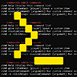

# Command64 
A spigot plugin that installs a local cron scheduler, runs commands with configurable triggers, and introduces a user-friendly reward system.

Created by tbm00 for play.mc64.wtf.

## Features
- **Simple, but Powerful** Use the 5 different entry types to create a variety of things from events to custom items. Use delays & checks to create chains or loops of commands that are initially triggered by a parent/root command, item, or player join(s). Or just use it for simpler means :D
- **Cron Schedule** Schedule command(s) to be run during specific times and/or intervals!
- **Sudo Commands** Run any command as someone else, a random player, or the console.
- **Join Commands** Run predefined command(s) when a player joins the server, with optional permission checks & newbie checks.
- **Custom Commands** Run predefined command(s) when a player uses a custom command, with optional delays, permission checks, online checks, inventory checks.
- **Command Items** Run predefined command(s) when a player uses a custom item, with optional permission checks.
- **Reward System** Let players redeem rewards FROM ANY PLUGIN when they want to, without losing items due to full inventory space.

## Dependencies
- **Java 17+**: REQUIRED
- **Spigot 1.18.1+**: UNTESTED ON OLDER VERSIONS

## Commands & Permissions
#### Commands
- `/cmd help` Display the admin command list
- `/cmd sudo <player>/RANDOM_PLAYER/CONSOLE <cmd>` Run command as someone else (plus signs convert to spaces in cmd)
- `/cmd give <itemKey> [player]/RANDOM_PLAYER [amount]` Spawn custom item(s)
- `/cmd <customCommand> [argument]/RANDOM_PLAYER [argument2]` Run custom command w/ optional argument(s)
- `/cmd -d <tickDelay> <customCommand> [argument]/RANDOM_PLAYER [argument2]` Schedule delayed custom command w/ optional argument(s)
- `/cmd reward <rewardName> <player>/RANDOM_PLAYER [argument]` Add reward to a player's queue w/ optional argument
- `/redeemreward` Redeem the reward at the top of your queue
#### Permissions
Each JoinCommandEntry, CustomCommandEntry, and ItemCommandEntry has configurable permission nodes (in `config.yml`) that must be fulfilled for a player to use the respective feature. The only hardcoded permission nodes are:
- `command64.help` Ability to display the admin command list *(Default: OP)*
- `command64.sudo.console` Ability to run commands as the console *(Default: OP)*
- `command64.sudo.player` Ability to run commands as someone else *(Default: OP)*
- `command64.enqueuerewards` Ability to add rewards to a player's queue *(Default: OP)*
- `command64.redeemrewards` Ability to redeem queued rewards *(Default: everyone)*

## Default Config
```
# Command64 v1.2.1 by @tbm00
# https://github.com/tbm00/Command64/

# By default, all modules are disabled.
# You should configure each section to your own liking.

# The predefined config is there to give you and idea of what  
# you can do when using this plugin with other plugins, like 
# EssentialsX, LuckPerms, MythicMobs, a crate plugin, and more.


# -----------------------------------cronSchedule--------------------------------------- #
# consoleCommand gets scheduled by the entry's cron expression.
#
# Use https://crontab.guru/ for help.
#
# Optional Arguments:
# <random_player> == random online player
# -------------------------------------------------------------------------------------- #
cronSchedule:
  enabled: false
  taskEntries:
  # - "m h dom mon dow consoleCommand"
    - "0 0 */1 * * say This command is triggered at midnight!"
    - "0,*/10 11-14 * * * say This command is triggered every 10 minutes between 11:00 AM and 2:59 PM!"
    - "0 * * * * eco give <random_player> 1000"


# -----------------------------------rewardSystem--------------------------------------- #
# This module gives players the ability redeem pending rewards (commands).
#
# 1st) Admins/Console add rewardEntries to a player's pending queue
#        by using `/cmd reward <rewardName> <username> [argument]`.
# 2nd) Players redeem rewards (in-order, unless there are skips due to full inv) by using `/redeemreward`.
#      -- If the player has no pending rewards, they will be sent noPendingRewardMessage.
#      -- Else if the the player has inventory space, the first rewardEntry's consoleCommands 
#           in the player's pending queue will be run.
#      -- Else if there is no pending reward without an invCheck, they will be sent noInvSpaceMessage.
#      -- Else the first rewardEntry's consoleCommands that doesn't have a invCheck will be run.
#
# Optional Arguments:
# <player> == player who is rewarded
# <random_player> == random online player
# <argument> == string included as running command's argument (plus signs convert to spaces)
# -------------------------------------------------------------------------------------- #
rewardSystem:
  enabled: false
  saveDataInterval: 60 # save data to json every X minutes, -1 to only save on shutdown
  newRewardMessage: "&8[&fRewards&8] &aYou just received a reward, claim it with &2/redeemreward&a!"
  pendingRewardsJoinMessage:
    message: "&8[&fRewards&8] &aYou have reward(s) to claim! &2/redeemreward"
    tickDelay: 300
  redeemMessages:
    noRewardMessage: "&8[&fRewards&8] &cYou don't have any pending rewards!"
    noInvSpaceMessage: "&8[&fRewards&8] &cYou don't have enough inventory space for your reward!"
    rewardedMessage: "&8[&fRewards&8] &aYou redeemed a reward!"
  rewardEntries:
    '1': # Usage: `/cmd reward cratekey <player>/RANDOM_PLAYER` i.e. "/cmd reward cratekey Notch 1"
      name: "cratekey"
      consoleCommands:
        - "crates givekey Crate <player>"
      invCheck: true
    '2': # Usage: `/cmd reward money <player>/RANDOM_PLAYER <quantity>` i.e. "/cmd reward money RANDOM_PLAYER 1000"
      name: "money"
      consoleCommands:
        - "eco give <player> <argument>"
      invCheck: false
    # Add/remove entries as needed


# --------------------------------joinCommandEntries------------------------------------ #
# consoleCommands get triggered when a player (whose checkPerm==checkPermValue)
#   connects to the server.
#
# You can add an firstJoinCheck to any customCommandEntry, that confirms player who joined
#   is not joining for the first time before running the consoleCommands. If they have not,
#   are joining for the first time, any defined backup commands will run. 
#   Use this module on any joinCommandEntries:
#     firstJoinCheck:
#       enabled: true
#       isFirstJoinConsoleCommands:
#         - "say <argument> joined for the first time!"
#
# Optional Argument:
# <player> == player who joined
# <random_player> == random online player
# -------------------------------------------------------------------------------------- #
joinCommandEntries:
  enabled: false
  '1':
    enabled: false
    checkPerm: "group.particlebase"
    checkPermValue: false
    tickDelay: 10
    consoleCommands:
      - "pp reset <player>"
  '2':
    enabled: false
    checkPerm: "group.donor1"
    checkPermValue: true
    tickDelay: 10
    consoleCommands:
      - "say Welcome back to the server <player>!"
  '3':
    enabled: false
    checkPerm: "group.donor1"
    checkPermValue: false
    tickDelay: 10
    consoleCommands:
      - "say <player>, why haven't you donated?"
      - "say Gimme yo money!"
  '4':
    enabled: false
    checkPerm: "group.default"
    checkPermValue: false
    tickDelay: 1200
    consoleCommands: []
    firstJoinCheck:
      enabled: true
      isFirstJoinConsoleCommands:
        - "cmd newbie-gift <player>"
  # Add/remove entries as needed


# ------------------------------customCommandEntries------------------------------------ #
# consoleCommands get triggered when the console or a player (whose usePerm==userPermVaue)
#   uses the associated customCommand.
#
# You can run any customCommand with a delay by using the "-d" command flag.
#   i.e. "/cmd -d 1200 stop" to stop the server in 1 minute,
# You can add an invCheck to any customCommandEntry, that confirms ARGUMENT or SENDER has
#   one spot avaliable in their inventory before running the consoleCommands. If they don't,
#   any defined backup commands will run. Use this module on any customCommandEntry:
#     invCheck:
#       enabled: true
#       checkOnPlayer: "ARGUMENT"
#       ifNoSpaceConsoleCommands:
#         - "msg <argument> &4You do not have space in your inventory..."
# You can add an onlineCheck to any customCommandEntry, that confirms ARGUMENT or SENDER is
#   online before running the consoleCommands. If they are not, any defined backup commands 
#   will run. Use this module on any customCommandEntry:
#     onlineCheck:
#       enabled: true
#       checkOnPlayer: "ARGUMENT"
#       ifNotOnlineConsoleCommands:
#         - "msg Console <argument> is not online!"
#
# Optional Arguments:
# <player> == player who used the command
# <random_player> == random online player
# <argument> == string included as running command's argument (plus signs DON'T convert to spaces)
# <argument2> == string included as running command's argument (plus signs convert to spaces)
# -------------------------------------------------------------------------------------- #
customCommandEntries:
  enabled: false
  '1': # Usage: "/cmd save"
    enabled: false
    usePerm: "command64.mod"
    usePermValue: true
    customCommand: "save"
    consoleCommands:
      - "say <player> is saving the server!"
      - "save-all"
  '2': # Usage: "/cmd stop"
    enabled: false
    usePerm: "command64.admin"
    usePermValue: true
    customCommand: "stop"
    consoleCommands:
      - "say <player> is stopping the server!"
      - "stop"
  '3': # Usage: "/cmd promote-donor <argument>" i.e. "/cmd promote-donor Notch"
    enabled: false
    usePerm: "command64.admin"
    usePermValue: true
    customCommand: "promote-donor"
    consoleCommands:
      - "lp user <argument> promote donor"
      - "say <argument> donated to the server and was promoted by <player>!"
  '4': # Usage: "/cmd console-msg <argument> <argument2>" i.e. "/cmd console-msg Notch hi+plus+signs+convert+to+spaces"
    enabled: false
    usePerm: "command64.admin"
    usePermValue: true
    customCommand: "console-msg"
    consoleCommands:
      - "msg <argument> <argument2>"
  '5': # Usage "/cmd boss-fight-start"
    enabled: false
    usePerm: "command64.mod"
    usePermValue: true
    customCommand: "boss-fight-start"
    consoleCommands:
      - "mm mobs spawn BossMinion -t world,-677,46,727"
      - "mm mobs spawn BossMinion -t world,-667,46,726"
      - "mm mobs spawn BossMinion -t world,-677,52,727"
      - "mm mobs spawn BossMinion -t world,-667,52,726"
      - "mm mobs spawn BossMinion -t world,-672,52,732"
      - "mm mobs spawn BossMinion -t world,-673,52,722"
      - "mm mobs spawn BossMob -t world,-672,36,727"
      - "broadcast &bBoss fight started!"
      - "cmd -d 1200 boss-fight-round2" # 1 minute delay
  '6': # Intended Usage "/cmd -d <tickDelay> boss-fight-round2" i.e. "/cmd -d 1200 boss-fight-round2"
    enabled: false
    usePerm: "command64.hide"
    usePermValue: true
    customCommand: "boss-fight-round2"
    consoleCommands:
      - "mm mobs spawn BossMinion -t world,-677,36,727"
      - "mm mobs spawn BossMinion -t world,-667,36,726"
      - "mm mobs spawn BossMinion -t world,-672,46,732"
      - "mm mobs spawn BossMinion -t world,-673,46,722"
      - "mm mobs spawn BossMinion -t world,-677,52,727"
      - "mm mobs spawn BossMinion -t world,-667,52,726"
  '7': # Intended Usage "/cmd tpr" - teleports the caller to a random player
    enabled: false
    usePerm: "command64.mod"
    usePermValue: true
    customCommand: "tpr"
    consoleCommands:
      - "cmd sudo <player> tp+<random_player>"
  '8': # Intended Usage "/cmd tprr RANDOM_PLAYER" - teleports a random player to another random player
    enabled: false
    usePerm: "command64.hide"
    usePermValue: true
    customCommand: "tprr"
    consoleCommands:
      - "cmd sudo CONSOLE tp+<argument>+<random_player>"
  '9': # Usage: "/cmd invSpaceCheckLoop <argument>" i.e. "/cmd invSpaceCheckLoop Notch"
    enabled: false
    usePerm: "command64.mod"
    usePermValue: true
    customCommand: "invSpaceCheckLoop"
    consoleCommands:
      - "msg <player> <argument> has space for an item!"
    invCheck:
      enabled: true
      checkOnPlayer: "ARGUMENT"
      ifNoSpaceConsoleCommands:
        - "msg <player> <argument> has a full inventory! Checking again in 2 minutes..."
        - "cmd -d 2400 invSpaceCheckLoop <argument>" # Re-call check with 2 minute delay
    onlineCheck:
      enabled: true
      checkOnPlayer: "ARGUMENT"
      ifNotOnlineConsoleCommands:
        - "msg <player> <argument> is not online... Ending loop!"
  '10': # Intended Usage "/cmd newbie-gift <argument>"
    enabled: false
    usePerm: "command64.admin"
    usePermValue: true
    customCommand: "newbie-gift"
    consoleCommands:
      - "crates givekey Crate <argument>"
    invCheck:
      enabled: true
      checkOnPlayer: "ARGUMENT"
      ifNoSpaceConsoleCommands:
        - "cmd reward cratekey <argument>"
    onlineCheck:
      enabled: true
      checkOnPlayer: "ARGUMENT"
      ifNotOnlineConsoleCommands:
        - "cmd reward cratekey <argument>"
  # Add/remove entries as needed


# ---------------------------------itemCommandEntries----------------------------------- #
# consoleCommands get triggered when a player (whose usePerm==userPermVaue)
#   uses a custom item.
#
# Optional Argument:
# <player> == player who used the item
# <random_player> == random online player
# -------------------------------------------------------------------------------------- #
itemCommandEntries:
  enabled: false
  '1':
    enabled: false
    givePerm: "command64.give.navigator"
    givePermValue: true
    usePerm: "group.default"
    usePermValue: true
    consoleCommands:
      - "cmd sudo <player> commandpanel+menugui"
    key: "NAVIGATOR"
    name: "&dServer Navigator"
    item: "COMPASS"
    glowing: true
    lore:
      - "&5Opens the server's menu GUI"
  '2':
    enabled: false
    givePerm: "command64.give.adminpick"
    givePermValue: true
    usePerm: "essentials.break"
    usePermValue: true
    consoleCommands:
      - "cmd sudo <player> break"
    key: "ADMINPICK"
    name: "&4Admin Pickaxe"
    item: "GOLDEN_PICKAXE"
    glowing: true
    lore:
      - "&cBreaks bedrock"
  '3':
    enabled: false
    givePerm: "group.mod"
    givePermValue: true
    usePerm: "group.mod"
    usePermValue: true
    consoleCommands:
      - "tp <player> <random_player>"
    key: "TELEPORTER"
    name: "&4Player Teleporter"
    item: "COMPASS"
    glowing: true
    lore:
      - "&cTeleports you to a random player"
  # Add/remove entries as needed

```